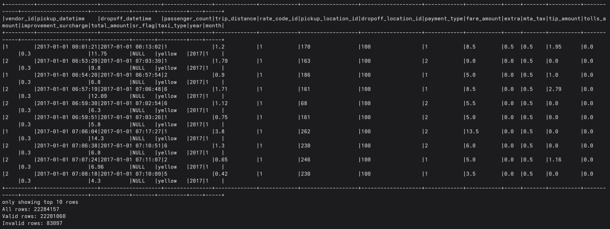
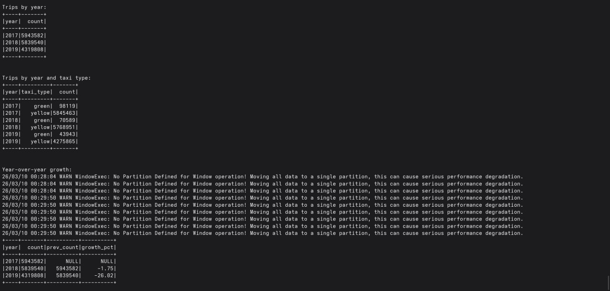
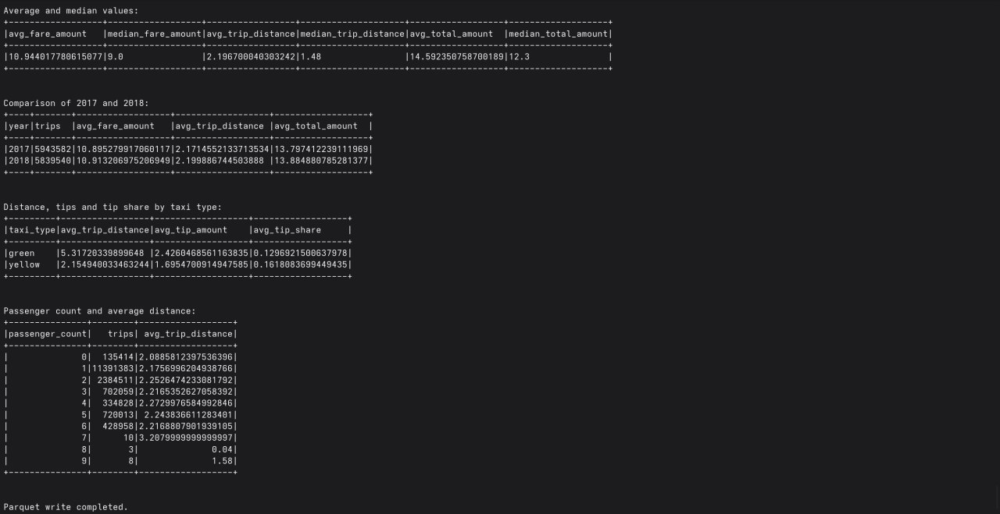
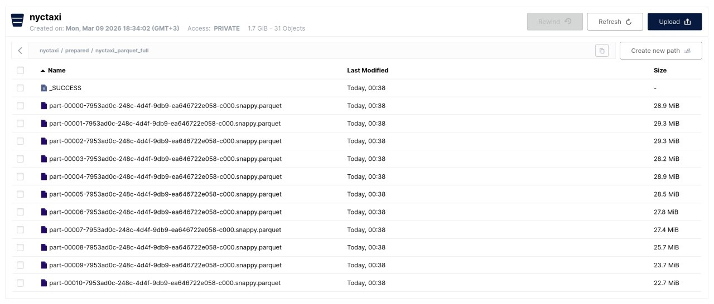
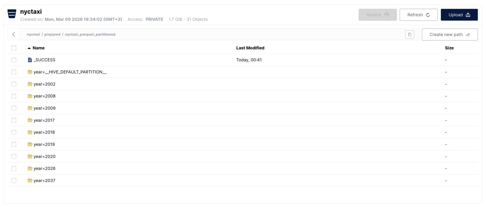
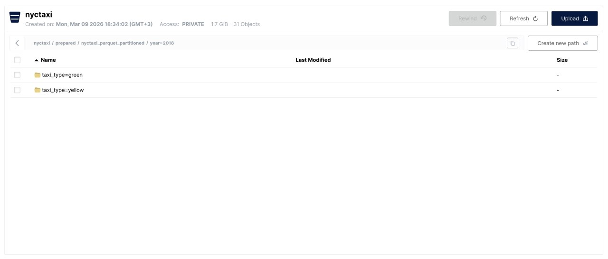
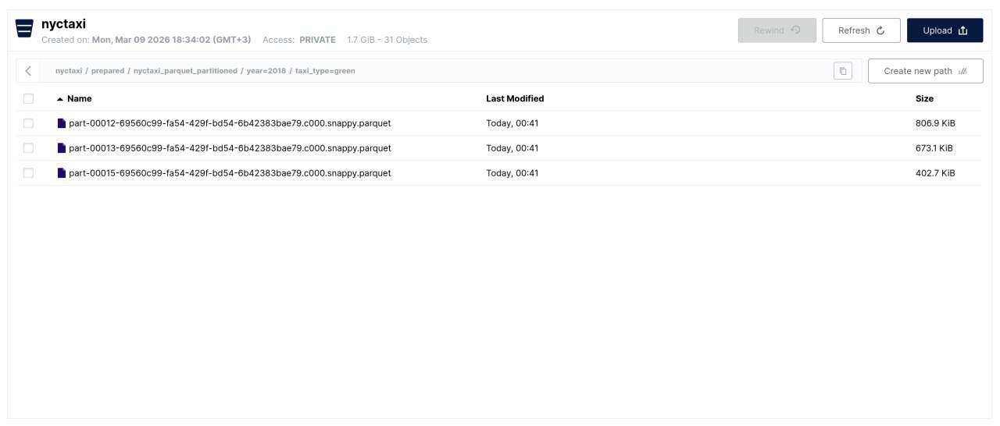

## Домашнее задание №2 для дисциплины «Обработка больших данных с помощью Python» МНАД ФКН ВШЭ

В рамках домашнего задания я скачал датасет [NYC Taxi](https://www.kaggle.com/datasets/teenakunsoth/nyctaxi) с Kaggle и использовал CSV-файлы по типам `yellow`, `green` и `fhv` как исходные данные для работы. Далее поднял S3-хранилище MinIO в Docker, подключил к нему Python и загрузил файлы в бакет с разбиением по трем каталогам. Затем запустил Spark в клиентском режиме, прочитал данные из S3, привел схемы разных типов такси к единому виду, переименовал совпадающие по смыслу поля, добавил недостающие столбцы со значением `NULL`, добавил поля `taxi_type`, `year` и `month`, разобрал даты в нескольких форматах и перевел их в `timestamp`, а числовые поля перевел в корректные числовые типы.

После этого я отделил корректные поездки от некорректных по правилам для дистанции, стоимости и временного интервала поездки. В результате получил очищенный датафрейм `df_clean`, который использовал как итоговый результат пайплайна. Для аналитики отдельно сформировал датафрейм `df_analytics`, в который включил только записи за 2017, 2018 и 2019 годы. На этих данных посчитал динамику поездок по годам и по типам такси, темпы роста и спада год к году, средние и медианные значения стоимости, дистанции и итоговой суммы, сравнил два годовых периода между собой, оценил среднюю дистанцию, чаевые и долю чаевых по типам такси, а также проверил связь между количеством пассажиров и дистанцией.

В конце я сохранил итоговый очищенный датафрейм `df_clean` в формате Parquet без партиционирования и отдельно записал его в S3 в партиционированном виде по `year` и `taxi_type`, после чего проверил итоговую структуру каталогов и файлов.

### Структура домашнего задания
```
HW_02/
├── docker-compose.spark.yml
├── README.md
└── scripts/
    ├── unify_taxi_schema.py
    └── upload_to_s3.py
```

### Инструменты

Python, PySpark, Apache Spark, Docker, MinIO (S3).

### Скриншоты

#### Единая схема и валидация


#### Динамика поездок и темпы роста


#### Агрегаты и сравнение периодов


#### Parquet без партиционирования


#### Корень партиционированного Parquet


#### Каталог года в партиционированном Parquet


#### Пример партиции по году и типу такси
